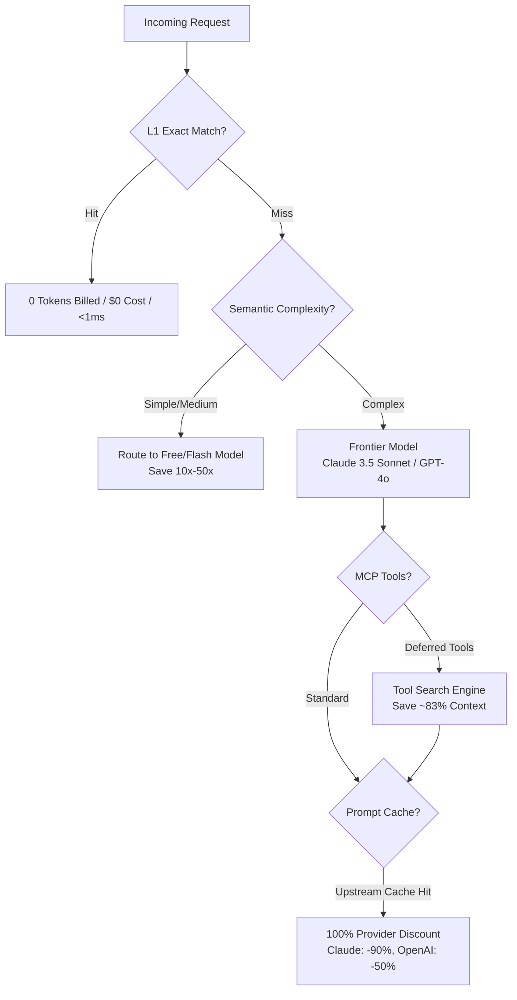

# Token & Cost Optimization Guide

As applications and autonomous AI agents scale, API token consumption and context bloat become major cost drivers. Connecting dozens of Model Context Protocol (MCP) tools, sending lengthy multi-turn chat histories, or making repetitive queries can quickly exhaust budgets and trigger rate limits.

DOS AI provides a comprehensive, multi-layer token optimization architecture directly inside the API Gateway. This guide outlines how to leverage these capabilities to reduce token overhead by up to **80%+** while maintaining maximum response quality.

---

## The 4 Pillars of Token Optimization



---

## 1. L1 Response Caching (Zero Tokens, Zero Cost)

For identical queries, calling an upstream LLM wastes both time and money. DOS AI includes an in-memory, exact-match L1 response cache.

* **Billing Impact**: **0 tokens billed, $0 cost**.
* **Latency**: Under 1 millisecond.
* **Streaming Replay**: Both non-streaming JSON and streaming Server-Sent Events (`stream: true`) are replayed instantly.
* **Security**: Enforces strict tenant isolation via `TenantCacheScope`. Cached responses are private to your authenticated identity (User ID, API Key ID, Team ID, Product, and BYOK credential) and are never exposed across users.

### How to use:
* **Automatic**: Enabled by default for all deterministic requests (`temperature: 0`).
* **Force on**: Pass header `X-DOS-Cache: on` (even for `temperature > 0`).
* **Bypass**: Pass header `X-DOS-Cache: off`.

See the full [Response Caching Guide](caching.md) for details.

---

## 2. Coding Agent Tool Search (~83% Context Reduction)

Modern autonomous coding agents (Claude Code, Cline, OpenCode/ZCode) often connect to multiple MCP servers (GitHub, PostgreSQL, Slack, Docker, filesystem tools). This frequently injects **300K – 450K tokens** of tool schemas on *every single request*.

DOS AI Gateway implements the full Anthropic Tool Search protocol (Stage A translation and Stage B server-side loop):

1. **Schema Withholding**: Tools flagged with `defer_loading: true` have their verbose JSON schemas withheld from the upstream prompt.
2. **On-Demand Search**: The model receives a compact `search_tools` utility and requests only the specific tools it needs.
3. **Dynamic Expansion & Consolidated Billing**: DOS AI Gateway searches and expands only matching schemas (`expandDiscoveredTools`), calls the continuation model, and merges usage into a single consolidated turn.

### Real-World Results:
* Evaluated against 460 MCP tools: Context window overhead dropped from **~425,000 tokens down to 68,400 tokens** (**~83% reduction**).
* To enable in Claude Code: set `export ENABLE_TOOL_SEARCH="true"` (or enable in CC Switch profile).

---

## 3. Upstream Prompt Caching & Zero-Markup Pass-Through

Foundation models offer significant discounts when reusing prompt prefixes:
* **Anthropic Claude**: **90% discount** on cached input tokens.
* **OpenAI & Azure OpenAI**: **50% discount** on cached input tokens (>1,024 tokens).
* **DeepSeek & DashScope**: Automatic context caching.

### Zero-Markup Guarantee:
Unlike traditional aggregators that mark up discounted tokens or retain prompt caching upside, DOS AI enforces a strict **Zero-Markup Policy**:
* 100% of upstream cache discounts are credited directly to your account.
* Gateway tracks `prompt_tokens_details.cached_tokens` and charges only the official discounted list price.
* Breakpoint markers such as Anthropic's `"cache_control": {"type": "ephemeral"}` are preserved end-to-end.

---

## 4. Semantic Complexity Routing (`dos-auto`)

Calling a top-tier frontier model (e.g. Claude 3.5 Sonnet or GPT-4o) for simple classification, code formatting, or brief Q&A is expensive and inefficient.

When you specify `model: "auto"` or `model: "dos-ai"`:
* DOS AI's `ClassifyComplexity` engine analyzes the prompt within a fraction of a millisecond.
* **Simple / Medium Queries**: Routed to internal hosted models or ultra-fast, cost-effective models (e.g. DeepSeek, Qwen 2.5 Coder, Flash tiers), saving **10x – 50x in cost**.
* **Complex / Reasoning Tasks**: Routed to top-tier frontier models.
* Look for response headers `X-DOS-Tier` and `X-DOS-Score`.

---

## 5. Context Compression (`X-DOS-Prompt-Compression`)

When transmitting long transcripts or massive file dumps (> 5,000 characters), enable the DOSRouter compression pipeline:

```bash
curl https://api.dos.ai/v1/chat/completions \
  -H "Authorization: Bearer dos_sk_your_key" \
  -H "X-DOS-Prompt-Compression: true" \
  -H "Content-Type: application/json" \
  -d '{"model": "qwen/qwen-2.5-coder-32b-instruct", "messages": [...]}'
```

* **Deduplication**: Prunes repetitive system guidelines and duplicate tool outputs.
* **Whitespace & JSON Compaction**: Normalizes redundant indentation while preserving syntax.
* **Fidelity**: 100% semantic meaning and code blocks remain intact.
* Check the `X-DOS-Compression-Savings` header to see how many characters were saved.

---

## 6. Preflight Guard & Safe Error Recovery

* **1.05x Preflight Guard**: If a request exceeds 1.05x the maximum context limit of the requested model, DOS AI immediately returns HTTP 413 `context_length_exceeded` locally. This prevents paying for doomed requests that would otherwise timeout or crash upstream.
* **Clean Error Codes**: DOS AI preserves standardized error codes so client agents (Cursor, Cline, Roo Code) know when to trigger automatic conversation compaction rather than getting stuck in expensive retry loops.

---

## Summary of Optimization Headers

| Header | Values | Purpose |
| :--- | :--- | :--- |
| `X-DOS-Cache` | `on`, `off` | Force L1 response caching on or off (default: on for `temperature: 0`). |
| `X-DOS-Prompt-Compression` | `true`, `false` | Enable multi-layer prompt compression for requests > 5,000 chars. |
| `ENABLE_TOOL_SEARCH` | `true` | Environment variable for Claude Code to enable 83% MCP context reduction. |
| `X-DOS-Tier` | *(response header)* | Shows complexity tier determined by `dos-auto` (`simple`, `medium`, `complex`). |
| `X-DOS-Compression-Savings` | *(response header)* | Shows character count saved by prompt compression. |
